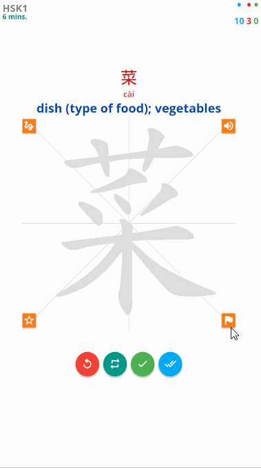

# AnkiDroid Custom Card Layout

Use AnkiDroid JavaScript functions to get cards details and design card like below. Turn on fullscreen and start reviewing in your custom Anki design.

# Demo

# For more visit
- [AnkiDroid Javascript API](https://github.com/ankidroid/Anki-Android/wiki/AnkiDroid-Javascript-API)
- [Related PR](https://github.com/ankidroid/Anki-Android/wiki/AnkiDroid-Javascript-API#linked-issues--pr)

### Download Decks

[Decks](Decks/)

### Usage
1. Turn on Gestures in AnkiDroid 
2. Map all Swipe gestures to No Action
3. Turn on Full Screen
4. Now Open the Sample Deck

### Resources
- [JavascriptInterface](https://developer.android.com/reference/android/webkit/JavascriptInterface)
- [pass-non-primitive-object-from-java-to-js-by-android](https://stackoverflow.com/questions/21173888/how-to-pass-non-primitive-object-from-java-to-js-by-android-addjavascriptinterfa)
- [check-if-a-string-is-a-valid-number](https://stackoverflow.com/questions/175739/built-in-way-in-javascript-to-check-if-a-string-is-a-valid-number)
- [grid.layoutit.com](https://grid.layoutit.com/)
- [codepen.io](https://codepen.io/)
- [www.w3schools.com](https://www.w3schools.com/)
