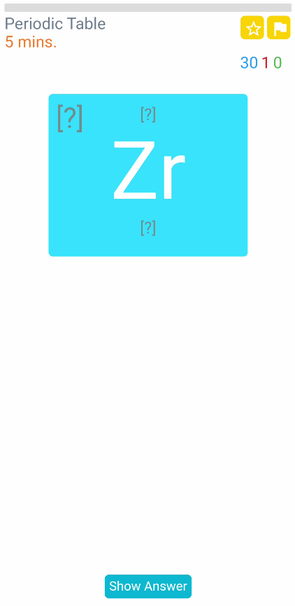
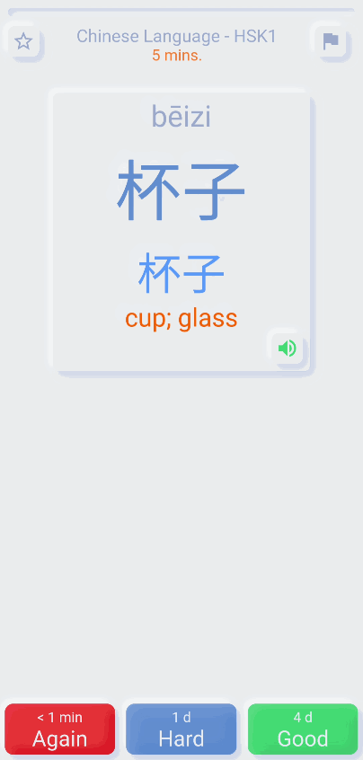

# AnkiDroid Custom Card Layout

Use AnkiDroid JavaScript functions to get cards details and design card like below. Turn on full screen and start reviewing in your custom Anki design. The API can also be used to hide JS API features on AnkiDesktop and AnkiMobile

### ankidroid-js-addon moved [here](https://github.com/infinyte7/ankidroid-js-addon)

**Note: AnkiDroid alpha *parallel* version can be downloaded for testing it. [AnkiDroid.A] also change directory to AnkiDroid.A in settings**
<br>AnkiDroid version > 2.13 
- [AnkiDroid Release Page](https://github.com/ankidroid/Anki-Android/releases)

### Download Example Decks

- [Decks](Decks/)

### Usage
1. Turn on Gestures in AnkiDroid 
2. Map all Swipe gestures to No Action
3. Turn on Full Screen
4. Now open the downloaded decks

# Example 1
```
Custom design for show answer button, /Again/Hard/Good/Easy/ button, 
mark card, toggle flag, review time, card count etc.
```
### Demo


# Example 2


# Example 3


- progress bar
- 110 commands
- font ```Orbitron```
- open ttyd in termux and view in ankidroid using ```iframe```. For more view [Add ttyd to termux and practice command](https://simplezhongwen.blogspot.com/2020/08/practice-linux-commands-using-ankidroid.html)

# Example 4


- Neumorphism design (Credits: [Codepen/myacode](https://codepen.io/myacode/pen/PoqQQNM )) 
- smooth progress bar (View [front.html](https://github.com/infinyte7/Anki-Custom-Card-Layout/blob/master/Example%204/front.html#L315))
- HSK1 word lists
- Random select from ```[Simplified, Traditional, Pinyin, Meaning]``` for quiz at front
- Audio

(Not supported night mode)

# Disclaimer
The software, code and website links available in this GitHub repo are provided "as is" without warranty of any kind, either express or implied. <br/>**Use at your own risk.**

# Contribution
Share custom card design made using AnkiDroid JS API.
- front card template, ```front.html```
- back card template, ```back.html```
- card template css, ```card.css```
- Sample deck

# Todo
- To add example commands to ```example 3``` deck

# For more visit
- [AnkiDroid Javascript API](https://github.com/ankidroid/Anki-Android/wiki/AnkiDroid-Javascript-API)
- [Related PR](https://github.com/ankidroid/Anki-Android/wiki/AnkiDroid-Javascript-API#linked-issues--pr)

### Resources
- [1-Line Layouts](https://1linelayouts.glitch.me/)
- [JavascriptInterface](https://developer.android.com/reference/android/webkit/JavascriptInterface)
- [pass-non-primitive-object-from-java-to-js-by-android](https://stackoverflow.com/questions/21173888/how-to-pass-non-primitive-object-from-java-to-js-by-android-addjavascriptinterfa)
- [check-if-a-string-is-a-valid-number](https://stackoverflow.com/questions/175739/built-in-way-in-javascript-to-check-if-a-string-is-a-valid-number)
- [grid.layoutit.com](https://grid.layoutit.com/)
- [codepen.io](https://codepen.io/)
- [www.w3schools.com](https://www.w3schools.com/)


### License
**Anki-Custom-Card-Layout**
<br>Mani (Infinyte7)
<br> Must give attribution, if using full or part of this project.
<br>[CC-BY-SA 4.0](https://creativecommons.org/licenses/by-sa/4.0/)
