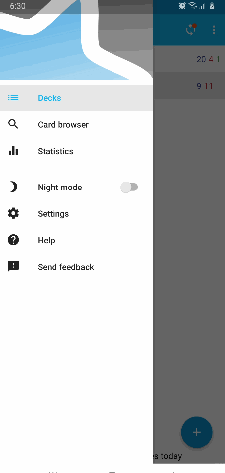
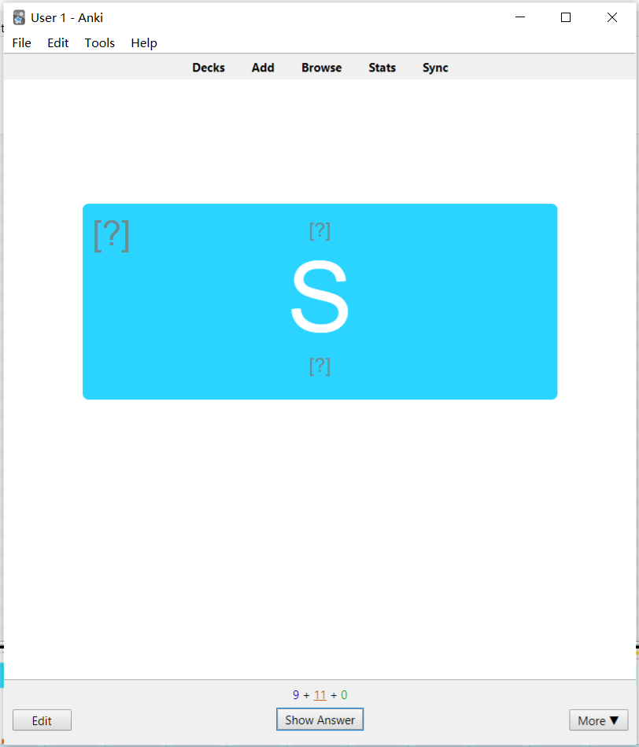
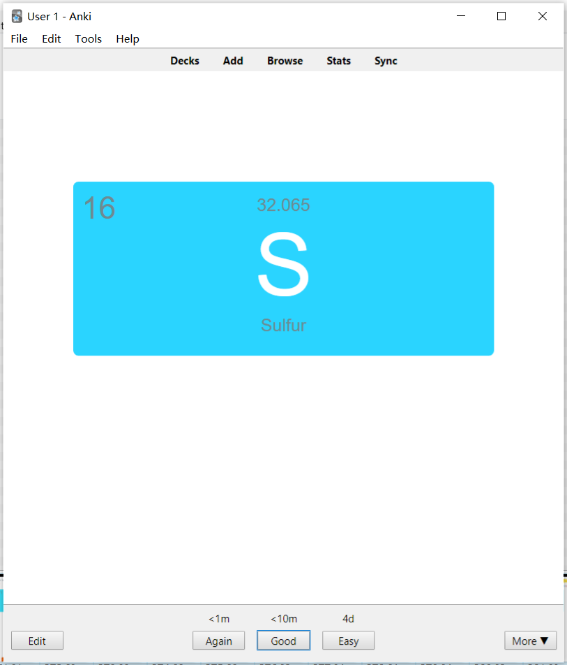
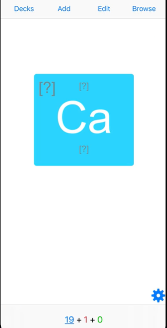
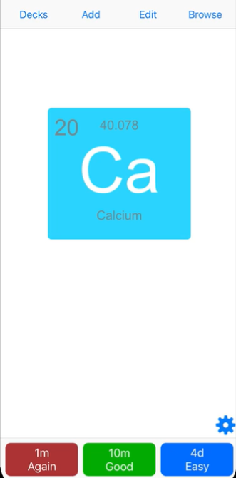

# AnkiDroid Custom Card Layout

Use AnkiDroid JavaScript functions to get cards details and design card like below. Turn on full screen and start reviewing in your custom Anki design. The API can also be used to hide JS API features on AnkiDesktop and AnkiMobile.

**Note: AnkiDroid alpha *parallel* version can be downloaded for testing it.**
<br>AnkiDroid version > 2.13 
- [AnkiDroid Release Page](https://github.com/ankidroid/Anki-Android/releases)

### Download Example Decks

- [Decks](Decks/)

### Usage
1. Turn on Gestures in AnkiDroid 
2. Map all Swipe gestures to No Action
3. Turn on Full Screen
4. Now open the downloaded decks

# Example 1
## Demo
### AnkiDroid
```
Custom design for show answer button, /Again/Hard/Good/Easy/ button, 
mark card, toggle flag, review time, card count etc.
```


### AnkiDesktop
All functionality of AnkiDroid JS API get **hidden** on AnkiDesktop.

|||
|--|--|

### AnkiMobile
All functionality of AnkiDroid JS API get **hidden** on AnkiMobile.
|||
|--|--|

# Example 2
## Demo


# For more visit
- [AnkiDroid Javascript API](https://github.com/ankidroid/Anki-Android/wiki/AnkiDroid-Javascript-API)
- [Related PR](https://github.com/ankidroid/Anki-Android/wiki/AnkiDroid-Javascript-API#linked-issues--pr)

### Resources
- [JavascriptInterface](https://developer.android.com/reference/android/webkit/JavascriptInterface)
- [pass-non-primitive-object-from-java-to-js-by-android](https://stackoverflow.com/questions/21173888/how-to-pass-non-primitive-object-from-java-to-js-by-android-addjavascriptinterfa)
- [check-if-a-string-is-a-valid-number](https://stackoverflow.com/questions/175739/built-in-way-in-javascript-to-check-if-a-string-is-a-valid-number)
- [grid.layoutit.com](https://grid.layoutit.com/)
- [codepen.io](https://codepen.io/)
- [www.w3schools.com](https://www.w3schools.com/)
